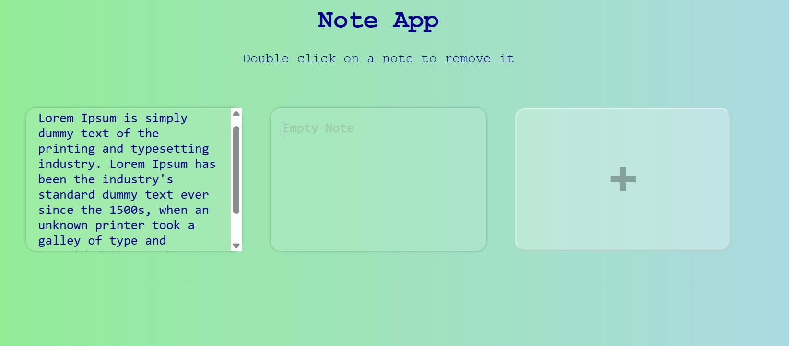

## 📝 NotePad  

A simple and functional **NotePad web app** built using HTML, CSS, and JavaScript. This lightweight tool allows users to write, save, and manage text notes directly in their browser—perfect for quick ideas, to-do lists, or daily journaling.

---

## 🚀 Features  
- ✅ Create and edit text notes in a simple UI  
- ✅ Update existing notes instantly
- ✅ Delete notes when no longer needed
- ✅ Save notes locally using `localStorage`  
- ✅ Automatically retains your notes even after closing the tab  
- ✅ Clean, responsive, and minimalist design  

---

## 🛠 Tech Stack  
- **HTML**  
- **CSS**  
- **JavaScript**

---

## 📷 Screenshots  
  

---

## 📌 How It Works  
1. Open the NotePad interface.  
2. Start typing your note.  
3. Your notes are **automatically saved** in the browser.  
4. Double click to Delete or remove unwanted notes.
5. Close and reopen the browser to find your notes still available.

---

## 📥 Download & Installation  

Clone this repository using Git:  
```bash
git clone https://github.com/aklema094/NotePad.git
```

Or download the ZIP file manually from [here](https://github.com/aklema094/NotePad/archive/refs/heads/main.zip).  
